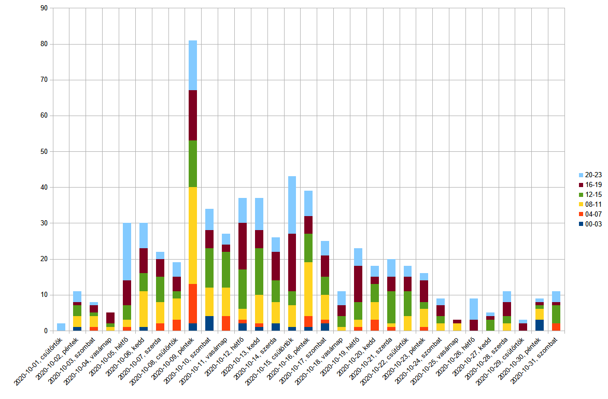

# study-2020-ujraterv-fb-szoba

### About
* What? post collection (for) study-2020-nive-ut-fb-szoba
  * Possible future directions: create a shared knowledge base, project wiki
* Why? Create a structure, that enables easier access to the interesting information related to the study program.
* How? Initial approach is manual collection and annotation of fb posts.
* Study program: 2020-nive-ut

### Tech Stack
* github, md
* LibreOffice Calc for filtering posts, creating pivot tables and charts

### General information
* Main content: [fb post permalink collection](./posts.md)
* See related post: [2020-10-13, 14:10](https://www.facebook.com/groups/ujratervezesprogram/permalink/636618217220537/)

#### Summary, permalink numbers
* Number of post permalinks in this collection
##### 2020-10

### Legal
* See the [main License of this repo](./LICENSE)
* Please check out the [general notes and warnings](https://rhanak1987-sandbox.github.io/hello-world/possible-license-concerns.html) and use it as a guideline, as if the file was placed into this project
* Please use common sense, act with good intentions AND due diligence
* Data sources are public group posts from: https://www.facebook.com/groups/ujratervezesprogram/
  * See relevant terms on facebook, like: [Mik azok a nyilvános adatok a Facebookon?](https://www.facebook.com/help/203805466323736)

###### fin
